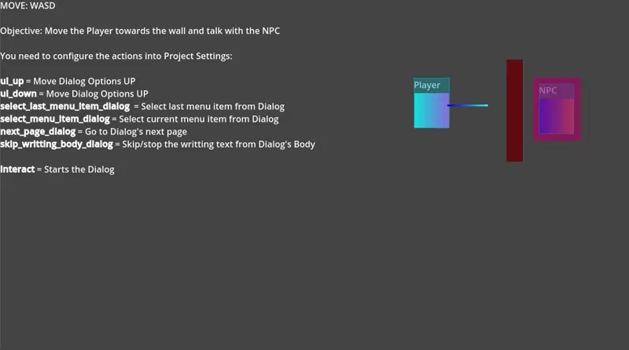

[](https://github.com/poingstudios/dialog-sharp/releases)


<!-- [](https://godotengine.org/asset-library/asset/1108) -->

# DialogSharp   

A powerful and flexible dialogue system plugin for Godot 4.x, implemented in C#.



## Features

- Easy-to-use dialogue UI system
- Support for branching dialogues with options
- Profile pictures support
- Customizable text display effects
- Full C# implementation
- Clean and modular architecture

## Setup Guide
### Required Input Actions
Create these actions in Project Settings → Input Map:

#### Dialog Controls
- `interact`: Start dialogue with NPCs
- `next_page_dialog`: Advance to next dialogue page 
- `skip_writting_body_dialog`: Skip text animation

#### Menu Navigation
- `select_menu_item_dialog`: Choose current option
- `select_last_menu_item_dialog`: Choose last option
- `ui_up`: Navigate options upward
- `ui_down`: Navigate options downward

### Scene Setup

#### Player Configuration
1. Add `DialogRayCast2D` or `DialogRayCast3D` to your player scene
2. Configure the collision mask
3. Set `IsConfigurated = true` to remove warnings
4. Implement the interaction input:

```csharp
public override void _Input(InputEvent @event)
{
    if (Input.IsActionJustPressed("interact"))
        dialogRayCast2D.Interact();
}
```

#### NPC Configuration
1. Add `DialogArea2D` or `DialogArea3D` to your NPC scene
2. Connect to the dialogue system:

```csharp
public override void _Ready() 
{
    DialogArea.DialogueStarted += DialogueStarted;
}

private DialogPageWithOptions DialogPage { get; set; } = new DialogPageWithOptions()
{
    Title = "NPC Name",
    Body = "What would you like to know?",
    Profile = ResourceLoader.Load<Texture2D>("path_to_profile"),
    Options = new[]
    {
        new DialogMenuOptions()
        {
            Text = "Tell me about yourself"
        },
        new DialogMenuOptions()
        {
            Text = "Show me your wares",
            NextPage = new DialogPageWithNextPage()
            {
                Title = "NPC Name",
                Body = "Here's what I have in stock..."
            }
        }
    }
};

private async void DialogueStarted(Node entity)
{
    await DialogUI.Instance.ShowDialogAsync(DialogPage);
}
```

## Quick Start
1. Open the sample scene: `res://addons/dialog_sharp/sample/DialogSharpSample.tscn`
2. Play the scene to understand the basic workflow
3. Use it as a template for your own dialogues

## Tips
- Dialogues can be stored as resource files for better organization
- Use branching dialogues to create complex conversation trees
- Customize the UI theme to match your game's style

## ⭐ Star History
If you appreciate our work, don't forget to give us a star on GitHub! ⭐

